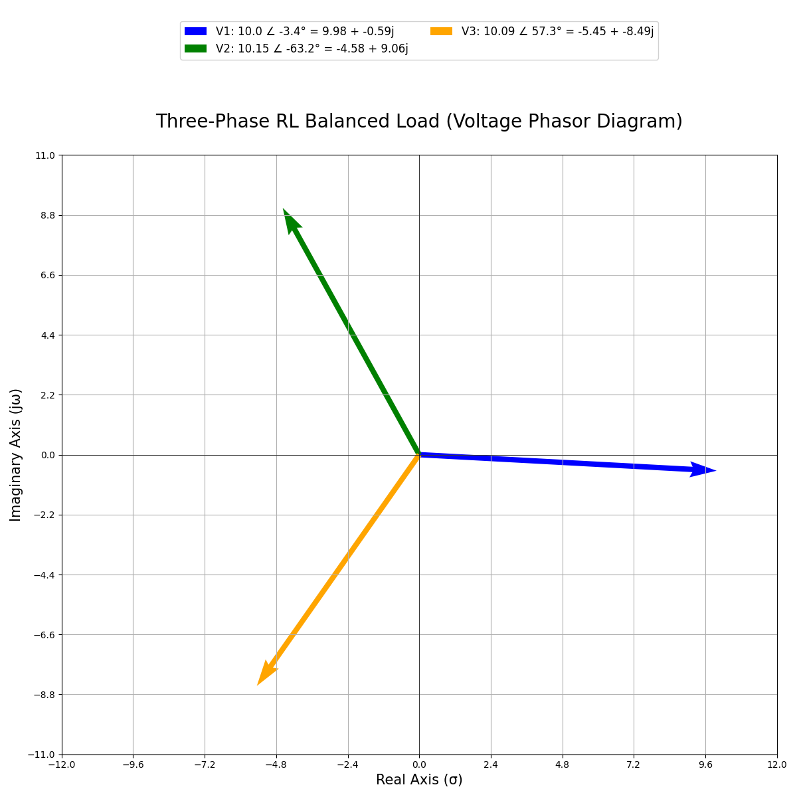

# Plot Tools : Electrical and Computer Engineering

## Contents

* [Overview](#Overview)
    * [Poles](#Poles)
    * [Root Locus](#Root-Locus)

## Overview

I wrote these **Python** scripts as a complementary tool in courses I took as part of <b>The University of British Columbia Electrical and Computer Engineering</b> undergraduate program.

These made my life easier in sharing data and producing reports. Please feel free to contribute to this repo and use these tools as part of your degree.

### Poles

The [`poles.py`](Scripts/poles.py) script can be used to generate a phasor plot of a filter with `matplotlib`. The `plot_poles(poles, real_lim, imag_lim)` function can be modified with the chart limits.

    

### Root Locus

The [`root_locus.py`](Scripts/root_locus.py) script can be used to generate root locus plots with `matplotlib`. The `root_locus(R, C, Am)` function can be modified with the resistance, capacitance, midband gain values.

Note that this is for the predetermined transfer function below. This is implemented as part of the script, but a few changes to the underlying formulas and calculations can be used to generate plots for like transfer functions.

$$ H(s) = \frac{1}{(R \times C)^{2} \times s^{2} + \frac{(3 - A_m)}{(R \times C)} \times s + \frac{1}{(R \times C)^{2}}} $$

    

### Phasors

I have just added a [`phasors.py`](Scripts/phasors.py) script for helping with three-phase system calculations and visualizing current-voltage relationships.

    

